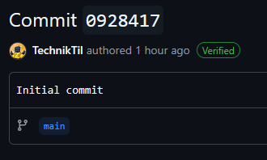

# Introduction


Have you ever seen a commit with this "verified" badge, and asked yourself how to do that with your commits? Well, look no further!

In this guide, I will be teaching you how to sign your commits with the **S**ecure **SH**ell Protocol (SSH).

# Requirements
To continue this guide, you need:
- Git Installed
- Basic knowledge of how to use a Terminal (Command Prompt)
- A web browser that's logged in to GitHub.

# The Tutorial

## Section 1: Generating your SSH Key
1. The first thing you want to do is open up Terminal.
	- If you are on Windows, open Git Bash instead.
2. Run `git config --global user.email`
	- If you didn't know, Git uses emails to identify people under the hood. This email is needed so that our signing key knows who to sign for.
3. Run `ssh-keygen -t ed25519 -C "[EMAIL]"`
	- Replace `[EMAIL]` with the email we got from Step 2.
	- The command will ask you where to save the key. This can be anywhere, just write it down for later. I'll be mentioning it as the **Key Path** from now on.
	- The command will also ask you for a passphrase. In my opinion, this isn't needed, so just skip through it by pressing enter.
## Section 2: Setting up the SSH key on your computer.
1. Start the SSH agent.
	- If you are on Windows, open PowerShell as an administrator and enter the commands below:
		```
		Get-Service -Name ssh-agent | Set-Service -StartupType Automatic
		Start-Service ssh-agent
		ssh-add [KEY_PATH]
		```
		- You can close the PowerShell window afterwards.

	- Otherwise, these commands can be entered:
		```
		eval "$(ssh-agent -s)"
		ssh-add [KEY_PATH]
		```
		- NOTE: The first command might need to be run as `root`, or it might not work entirely. [Read this article from GitHub](https://docs.github.com/en/authentication/connecting-to-github-with-ssh/generating-a-new-ssh-key-and-adding-it-to-the-ssh-agent?platform=linux#adding-your-ssh-key-to-the-ssh-agent) for troubleshooting.
	- In the commands, replace `[KEY_PATH]` with the Key Path we got from [Section 1, Step 3](#section-1-generating-your-ssh-key).
2. Run the commands below:
	```
	git config --global gpg.format ssh
	git config --global user.signingkey [KEY_PATH]
	git config --global commit.gpgsign true
	```
	- Replace `[KEY_PATH]` with the Key Path.
3. Run `cat [KEY_PATH].pub`
	- Replace `[KEY_PATH]` with the Key Path. The `.pub` should be kept, otherwise we'll get the private key, which is something we don't want.
	- Copy the contents returned from this command into your clipboard, since we'll use it in the next step.
## Section 3: Setting up the SSH key on GitHub.
1. Open the [SSH and GPG keys](https://github.com/settings/keys) section inside your GitHub settings.
2. Press `New SSH Key`.
	- The title can be anything, so go wild.
	- Set `Key Type` to `Signing Key`.
	- The `Key` should be the contents from [Section 2, Step 3](#section-2-setting-up-your-ssh-key-for-commit-signing).
3. Press `Add SSH Key`.

# Conclusion

Congratulations! Every commit you make from now on will be signed!

If for whatever reason you don't want to sign your commits anymore, you can do so by running the command below:
```
git config --global commit.gpgsign false
```

If you have any questions, feel free to make a discussion on the repository!